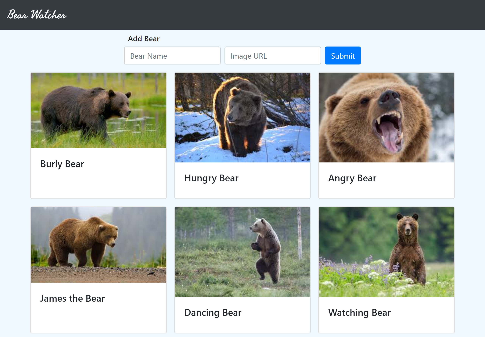

# Dino Kennel

## Description 
This project is used to show javascript modules. It is designed to be a record keeping application for a bears catching fish.

### Feature List
* Add Bear form when page loads
* Input of Bear Name and Image URL accepted
* Submit button displays a card with bear image and name

## Screenshots
### Full Page view

## How to Run
1. Clone down this repo
2. Make sure you have http-server installed via npm. If not get it
[HERE](https://www.npmjs.com/package/http-server)
3. On your command line run `hs -p 8080`
4. In your browser go to `https://localhost:8080`

## Contributors
Owner: Joey Petrone

Instructor: Zoe Ames
